# Helpful Links
- [Data Structures for Coding Interviews](https://www.interviewcake.com/article/python/data-structures-coding-interview?course=dsa)
- [Video: Intro to Binary Heaps](https://www.youtube.com/watch?v=WCm3TqScBM8)
- [Big O Notation](https://www.bigocheatsheet.com/)

# Runtime Complexity

Big O notation
 

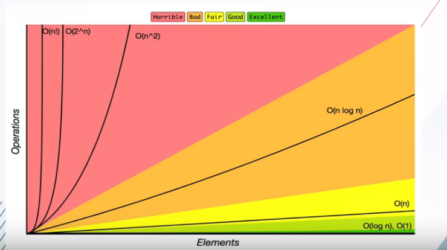

## Runtimes
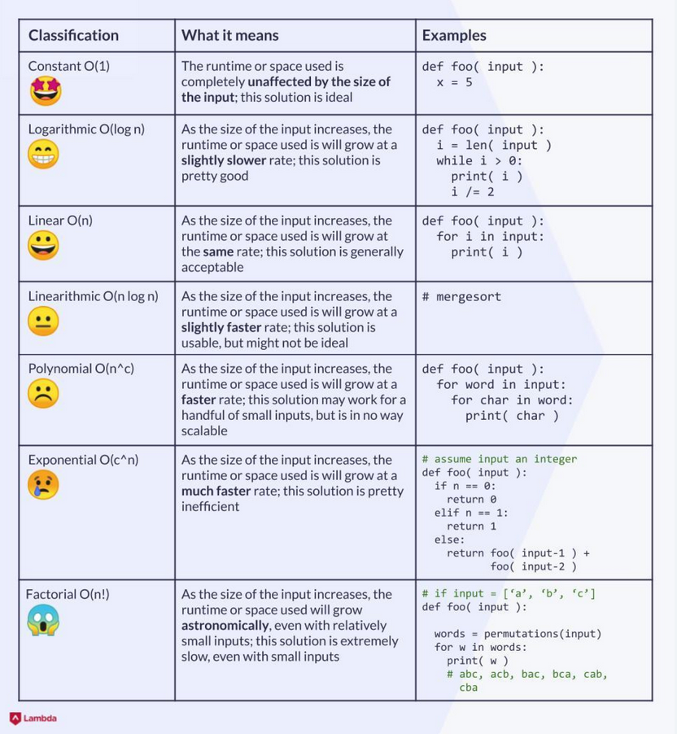

------------------------------------

### Constant Time

`Executes the same number of operations regardless of the size of the input.`
- Getting index from array
 

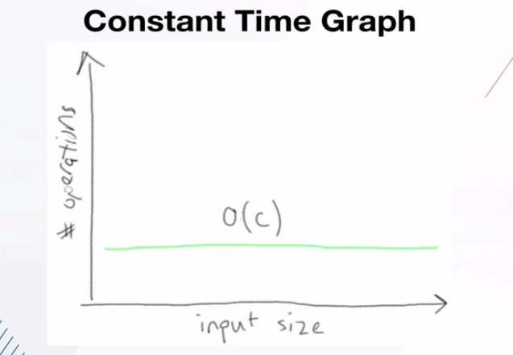

------------------------------------

### Logarithmic Time
`Increases the number of operations it performs as log function of the input size`
- Binary search as example
 

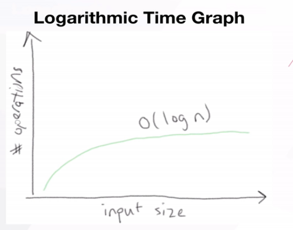

------------------------------------

### Linear Time
`Increases the number of operations it performs as a linear function of the input size n`
- Grows in direct porportion to input size n
 

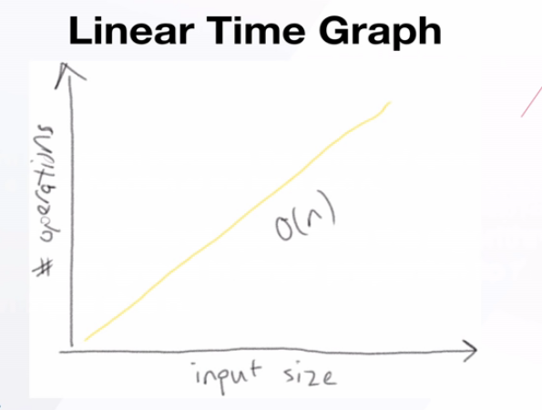

------------------------------------

### Log-Linear Time
`Increases the number of operations it performs as a log-linear function of input size n.`
- Look over each element and do work on each
- Sorting
 

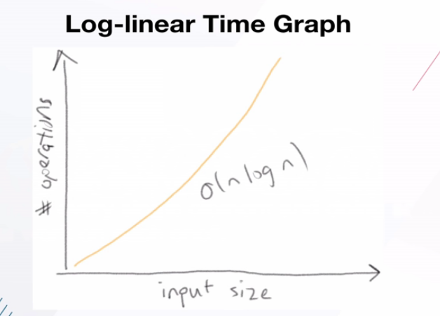

------------------------------------

### Quadratic Time
`Increases the number of operations it performs as a quadratic function of input size n.`
- $n = 10 \rightarrow n^2 = 100$
- Enumerate over strings
- Bubble sorting
 

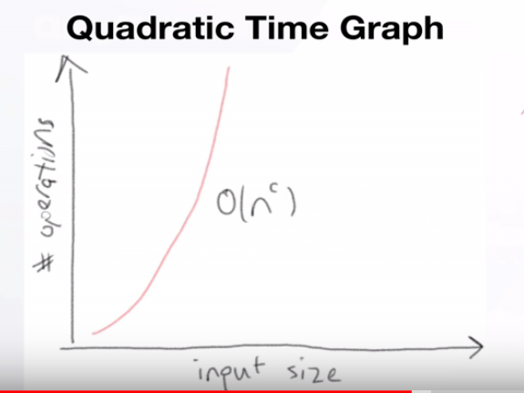

------------------------------------

### Exponential Time
`Increases the number of opertations it performs as an exponential function of the input size n.`
- Best computers can do now
- Nested loops
- Cracking a password
 

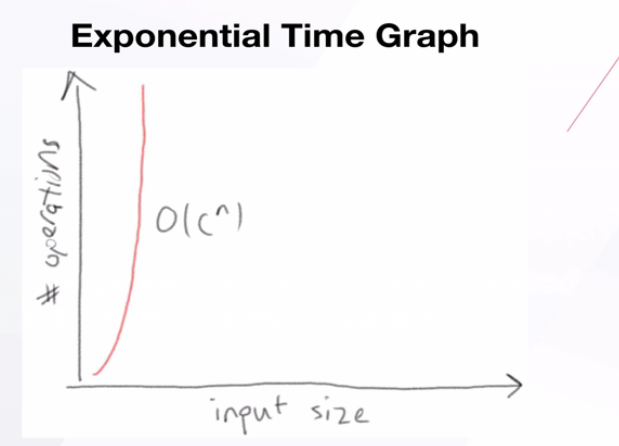

------------------------------------

# Linked Lists
- Used to store lists of values
- Different from Array
  - LL store each element as *isolated* node
  - Each node has pointers or references
  - Arrays holds elements in a continuance fashion
- Nodes do not know about the previous node
- Adding a new by pointing it to the tail
 

Terms to know:
- Head = first element/node
- Tail = last element/node - points to NONE
- Value = actual value stored in node
- N = NONE
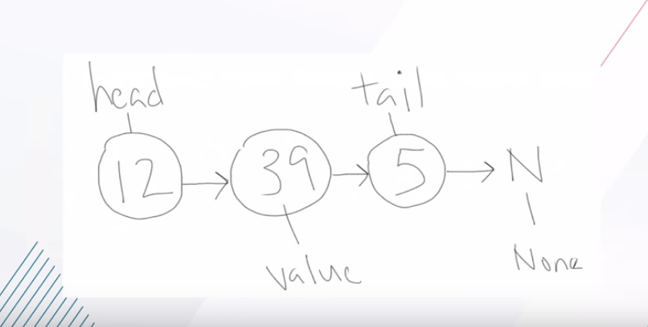
 

Pros and Cons:
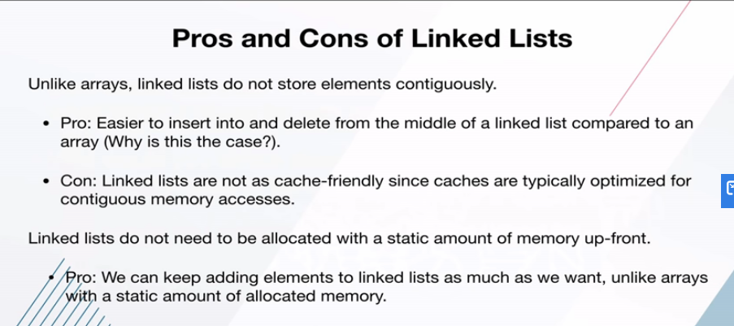

-----------------------------------------------

# Queue Data Structure

## First In First Out - FIFO
The sorting order as one comes in one goes out
 

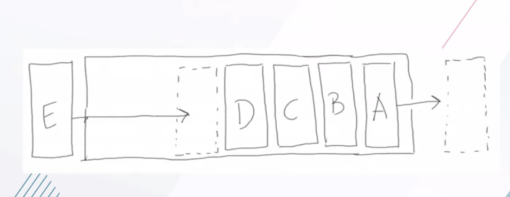

## Pros and Cons of Queue
 

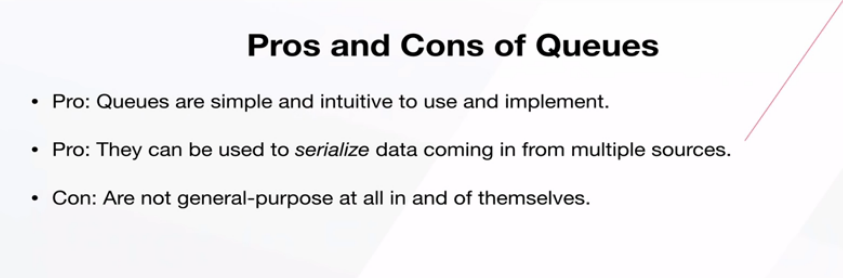

# Algorithms
- set of instructions to complete a task
- every piece of code is an algorithm

## Measuring Algorithms
- Most efficient based on time and space efficiency